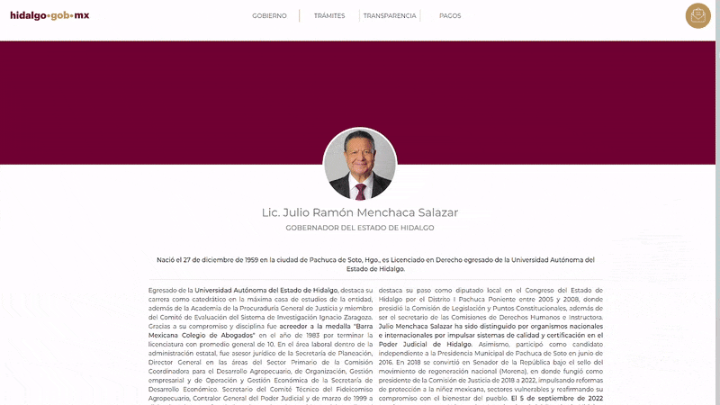
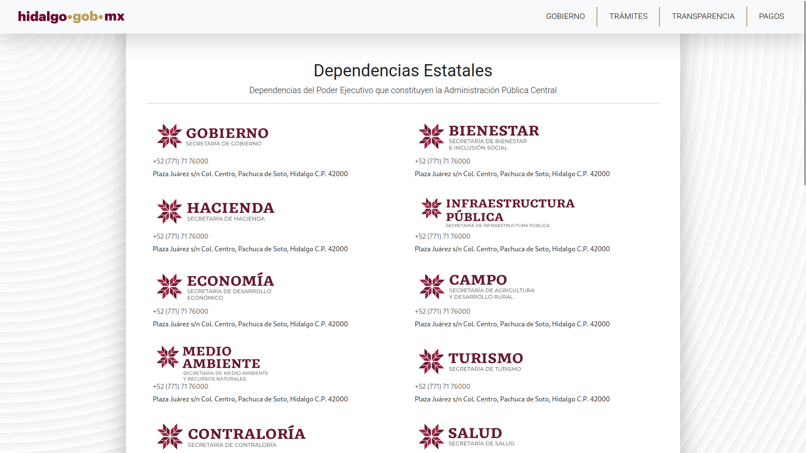
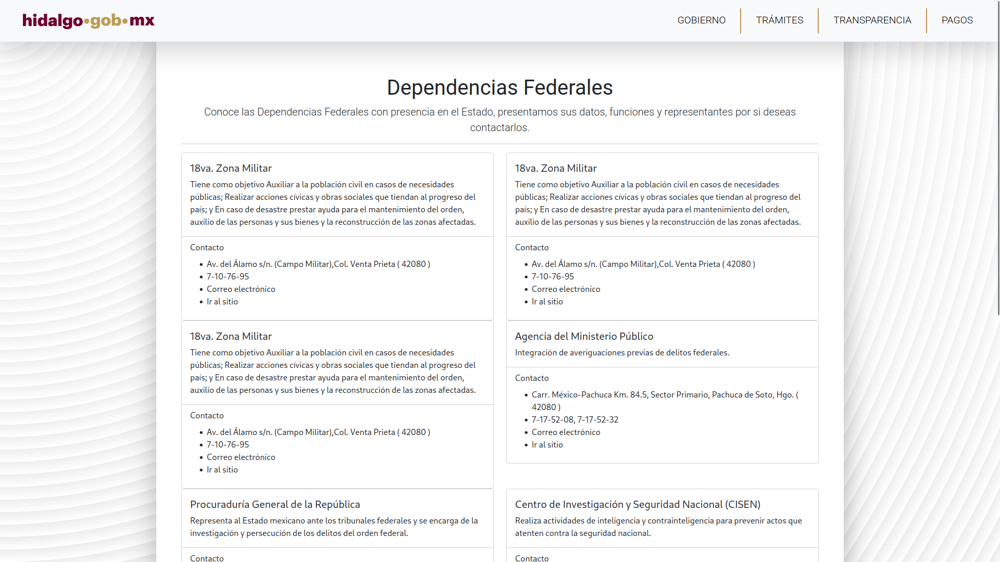
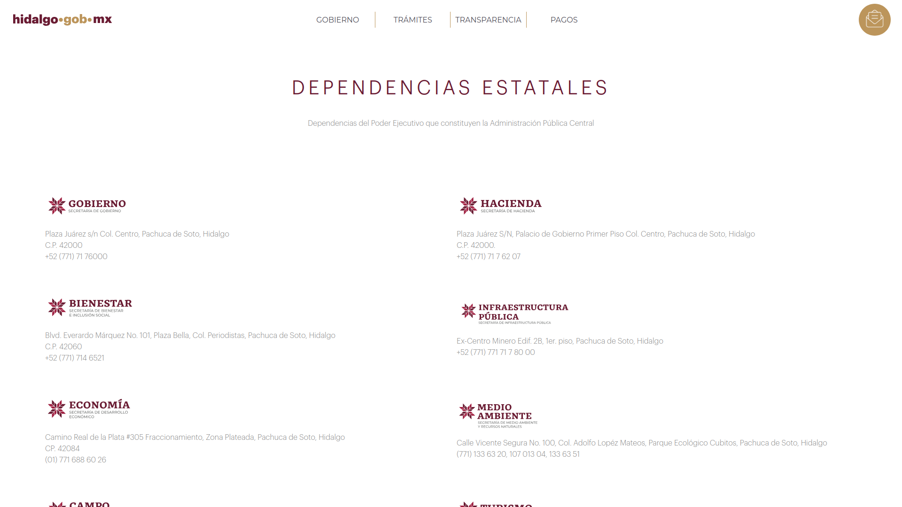
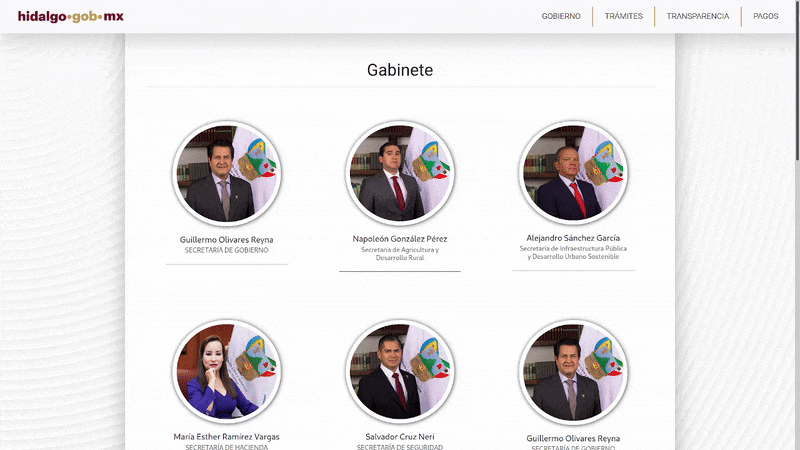

# Sitio Web de Gobierno de Hidalgo
Este fue un **Proyecto Universitario** que consistió en realizar un sitio web sobre el **Gobierno de Hidalgo** en el lapso de un día. El proyecto consistió en **crear una propuesta** sobre el [sitio web oficial](https://www.hidalgo.gob.mx/), que mejorara aspectos del diseño y estilos originales para tener una mejor estética de la pagina de ese momento.

## Notas
- Este proyecto fue desarrollado únicamente con fines educativos y no está afiliado al **[Gobierno del Estado de Hidalgo](https://www.ford.mx/)**.<br>
- Se realizò todo el proyecto en **un solo día** como parte de un reto universitario para aprender a implementar las tecnologias usadas en este proyecto.<br>
- Se pueden hacer mejoras futuras en el diseño, accesibilidad y rendimiento.

## Tecnologías y Lenguajes Usados
Son los lenguajes, recursos y frameworks usados en el proyecto:  
1. CSS3
1. HTML5
1. Bootstrap
1. Google Fonts

## Preview del Sitio  

1. **Seccion Inicio - Header**<br>  
   *Dentro de esta seccion se diseño una pagina similar a la original ejemplificando las secciones originales, con diseños propios y una barra de navegación mejorada*

   <br><br>

2. **Seccion Inicio**<br>
   *El resto de la página de inicio contiene vínculos a más información en el sitio Original y una estructura que ejemplifica donde se agregaria la informacion de la pagina original*  

   <br><br>

3. **Seccion del Gobernador de Hidalgo**<br>  
   *Se rediseñó la página con los datos del Goberandor de Hidalgo, usando clases CSS propias, con el fin de crear una propuesta esteticamente mejor*
   - #### Propuesta Mejorada (Este Proyecto)<br><br>   
   - #### Diseño de la Página Original<br><br> <br><br>

4. **Dependencias Federales**<br>  
   *De igual forma se rediseñaron para tener mejor estètica*  

   - #### Propuesta Mejorada (Este Proyecto)<br><br>
   <table>
        <tr>
            <td></td>
            <td></td>
        </tr>
    </table>

   - #### Diseño de la Página Original<br><br>
    <table>
        <tr>
            <td></td>
            <td></td>
        </tr>
    </table>

5. **Gabinete**<br>  
   *Se resideñó esta seccion para un mejor aspecto visual* 
   - #### Propuesta Mejorada (Este Proyecto)<br><br>   
   - #### Diseño de la Página Original<br><br> <br><br>

## ¿Cómo probar el proyecto?  

1. Clonar o descargar este mismo repositorio:  
   ```bash
   git clone https://github.com/MiguelDotDev/portal-ford.git

2. Abrir index.html en un navegador